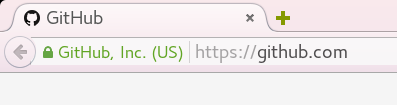

## HTTPS 的必要性

1.  保护用户隐私、账号安全 HTTPS 在客户端和服务器之间传输加密内容，即使被窃听，也极难解密；而 HTTP 明文传输。 对于用户登录操作，使用 HTTP 很难保证用户的账号安全：若明文传输，攻击者很容易窃听；若使用固定的加密算法，攻击者虽难以得到明文密码，但能够通过重放攻击假冒用户登录。
2.  防止被劫持 在国内运营商劫持、挂广告异常猖獗的网络环境下，普及 HTTPS 非常必要。 注意，要防止被劫持，必须全站都上 HTTPS，不加载任何非 HTTPS 的资源，否则还是可以被劫持。

<!--more-->


HTTPS 不能保证绝对的安全，但能极大地提高攻击/劫持的门槛和代价，这足矣。

## 证书

要部署 HTTPS，需要证书。证书主要包含一对公钥和私钥，用来加密客户端和服务器之间传输的内容。 任何人都可以生成证书，但只有权威证书颁发机构（Certificate Authority，简称 CA）颁发的证书才会被主流浏览器所信任。CA负责对申请者进行审核，对证书的安全性做担保。 证书按验证等级主要分为三类：

1.  域名验证（Domain Validation，简称 DV），颁发时只验证域名所有权，任何人（包括坏人）都可以申请。申请简单，费用较低，很适合个人网站、中小企业；
2.  机构验证（Organization Validation，简称 OV），需验证域名所有权，且申请机构是一个合法的实体组织；
3.  扩展验证（Extended Validation，简称 EV），CA 需要对申请者进行更复杂的审核和认证。对于 EV 证书，浏览器通常会将地址栏显示为绿色，并显示证书所有者名称。因此电商、支付等领域通常使用这种证书。 

     

由于存在审核、审计、担保等成本，申请证书通常是收费的，一些 EV 证书甚至高达数千美元/年。

## Let's Encrypt

[Let's Encrypt](https://letsencrypt.org/)是一个免费、自动化、开放的证书颁发机构，由网络安全研究小组（Internet Security Research Group，简称 ISRG）运作。 ISRG 是一个关注网络安全的公益组织，主要赞助商包括 Mozilla 基金会、Akamai、思科、电子前哨基金会（Electronic Frontier Foundation，简称 EFF）、Facebook、IdenTrust、互联网协会（Internet Society）等，参与者还有密歇根大学、斯坦福法学院、Linux 基金会等。 Let's Encrypt 致力于扫除资金、服务器配置等障碍，以使加密连接成为互联网的标配。 Let's Encrypt 的[关键原则](https://letsencrypt.org/about/)是：

*   免费：任何拥有域名的人都能免费得到一个受信任的证书
*   自动化：运行在 Web 服务器上的软件（即官方提供的客户端）能与 Let's Encrypt 交互，毫不费力地获取一个证书，安全地配置使用它，自动处理续期
*   安全：Let's Encrypt 将会作为高级 TLS 安全最佳实践的一个平台，不论是在证书颁发机构方面还是帮助网络维护者正确地保护他们的服务器方面
*   透明：所有颁发和撤回的证书都有公开记录，任何人都可以检查
*   开放：自动颁发和续期协议将会公开为一个开放的标准，其他人也可以采用
*   合作：就像底层的网络那样，Let's Encrypt 是一次使社区受益的共同努力，不受任何一个组织的控制

### 发展历史

* 2012年，Mozilla 的两个员工发起 Let's Encrypt 项目
* 2013年5月，ISRG 成立
* 2013年6月，电子前哨基金会和密歇根大学参与的一个项目合并进来
* 2014年11月18日，Let's Encrypt 宣布公开
* 2015年1月28日，ACME（Automatic Certificate Management Environment）协议提交到 IETF（互联网工程任务小组）请求标准化
* 2015年4月9日，ISRG 和 Linux 基金会宣布合作
* 2015年6月初，根证书和中间证书生成
* 2015年6月16日，宣布最终发布计划：7月27日颁发第一个证书，然后经过一个限量发行期测试安全性和伸缩性，若进展顺利，公共服务预计在9月14日开始提供
* 2015年8月7日，推迟发行计划以提供更多时间确保系统安全性和稳定性：9月14日颁发第一个证书，11月16日提供公共服务。与 IdenTrust 的交叉授权预计会在 Let's Encrypt 向公众开放时可用
* 2015年9月14日，颁发了第一个证书给域名[helloworld.letsencrypt.org](https://helloworld.letsencrypt.org/)
* 同日，ISRG 向 Mozilla, Microsoft, Google, Apple 提交了根应用申请（英文为root program applications，不确定翻译的对不对）
* 2015年11月12日，宣布推迟公开服务时间，第一次公测会在12月3日开启
* 2015年12月3日，开启公测。

### 证书

Let's Encrypt 只颁发域名验证证书，有效期 90 天。支持多域名证书，但不支持使用通配符。

有效期很短，官方表示这是出于安全考虑，降低错发证书、证书泄露后的危害，自动化续期可以解决续期的麻烦。

### 免责声明

Let's Encrypt 目前处于公测期间，工具、文档尚不完善，谨慎用于生产环境。

## 申请 Let's Encrypt 证书

申请证书需要使用官方客户端，官方客户端除申请证书外，也可自动配置Web服务器使用证书。

**申请频率有[限制](https://community.letsencrypt.org/t/beta-program-announcements/1631)**，目前为：

*   申请限制：每个 IP 每 3 小时不超过 10 次
*   证书数量限制：每个域名（按二级域名计，子域名的证书也计入二级域名），每 7 天不超过 5 个

因此测试需谨慎。

我的域名（[vanitas.me](https://vanitas.me)）原本在内测期间就已申请、配置了证书，在编写本文期间出于测试目的多申请了几次，结果超出限制了，而旧证书又全都被我删掉了，导致用不了 HTTPS，于是不得不另寻了一个证书（[WoSign](http://www.wosign.com/products/free_ssl.htm)的免费证书，有效期一年，也是个不错的选择）。

这件事告诉我们，备份证书或者有一个备用证书很重要。

### 安装官方客户端

目前仅支持 Unix-like 的系统，需要 Python 2.6 或 2.7，暂不支持 Python 3。

可以到 Let's Encrypt 的 [GitHub Wiki](https://github.com/letsencrypt/letsencrypt/wiki/Packaging)查看你使用的操作系统已经打包官方客户端。

若未打包，可以使用 pip 安装，或者使用官方封装的 shell 脚本 letsencrypt-auto。

目前官方推荐使用 lestencrypt-auto，但 letsencrypt-auto 暂不支持 nginx。如果使用 Nginx 服务器，需要通过 pip 安装。

CentOS 7.1：

```shell
# 安装/更新依赖，否则安装或运行时会报错
sudo yum group install "Development tools"
sudo yum install python-devel
sudo yum install dialog
sudo yum install libffi-devel
sudo pip install --upgrade six
sudo yum install python-pip
sudo pip install letsencrypt
sudo pip install letsencrypt-nginx
```

Ubuntu 14.04：

```shell
# 只有安装/更新下列依赖后，才能成功安装和执行letsencrypt
sudo easy_install --upgrade pip  # python-pip包版本过旧，此命令能安装pip最新版本
sudo apt-get install python-dev
sudo apt-get install dialog
sudo pip install libffi-dev
sudo pip install cryptography
sudo pip install zope.component
sudo pip install pyrfc3339
sudo pip install werkzeug
sudo pip install --upgrade requests

sudo pip install letsencrypt
sudo pip install letsencrypt-nginx
```

安装后，即可在命令行下使用 `letsencrypt` 命令。 若要使用 letsencrypt-auto，只需检出/下载 [Let's Encrypt 源代码](https://github.com/letsencrypt/letsencrypt)，在命令行下进入代码目录，执行 `./letsencrypt-auto`，用法与通过pip安装的 `letsencrypt` 相同。

### 域名验证

客户端申请证书时需要验证域名所有权，有两种方式：

1.  手动，按照提示在申请证书域名的服务器上使一个指定的URL提供一个指定内容的文件。这种方式不方便自动续期，不推荐。
2.  在域名对应的服务器上使用客户端，并运行一个绑定 80 或 443 端口的 Web 服务器，然后客户端自动进行验证。支持两种模式：
    *   独立模式，客户端自己开启一个服务器，但需要临时关闭其它使用 80 或 443 端口的服务器，如果其它服务器正在提供服务，就会造成服务中断，不推荐。
    *   使用已经运行的其它服务器，目前支持 apache 2.x, webroot, nginx（对 nginx 的支持还处在实验阶段，暂未随 letsencrypt-auto 安装）。

使用不同模式需要在执行 letencrypt 命令（或 lencrypt-auto）时提供不同参数：

* `--manual`: 手动
* `--standalone`: 独立模式。可配置使用80还是443端口：
* `--apache`
* `--webroot`
* `--nginx`

### 申请证书

以 Nginx 模式为例，其它模式下用法基本相同，具体请看[官方文档](https://letsencrypt.readthedocs.org/en/latest/index.html)。

 **申请证书过程中 letsencrypt 会修改 nginx 配置文件，强烈建议在使用前备份配置文件。可直接在配置文件目录下创建 git 仓库进行备份。**

```shell
# 仅获取证书
sudo letsencrypt certonly --nginx -d domain1.com -d domain2.com -m YourEmail
# 去掉安装过程中对nginx配置文件的修改。虽然默认也会去掉，但空格、换行等不会恢复
sudo letsencrypt rollback

# 获取证书并自动配置nginx使用证书
sudo letsencrypt --nginx -d domain1.com -d domain2.com -m YourEmail
```

`-d`（或 `--domains`）参数指定要申请证书的域名，可指定多个域名（多个 `-d` 参数或逗号分隔多个域名），若不指定，letsencrypt 会尝试从 nginx 配置文件中提取域名 执行 `letsencrypt --help all` 看完整子命令、参数的说明。

### 客户端配置文件

为避免每次执行命令都输入很多参数的麻烦，可以将参数保存到配置文件中。 默认查找的配置文件位置为 `/etc/letsencrypt/cli.ini`，`$XDG_CONFIG_HOME/letsencrypt/cli.ini`（或 `~/.config/letsencrypt/cli.ini`，如果 `$XDG_CONFIG_HOME` 未设置），也可以在执行命令时手动指定配置文件路径。

可从 GitHub 获取[示例文件](https://github.com/letsencrypt/letsencrypt/blob/master/examples/cli.ini)。

```ini
# 2048或4096。越长越安全，但加解密时也会消耗更多资源
# rsa-key-size = 4096

# 同意服务条款（Terms of Service），避免让用户确认是否同意
agree-tos = True

# 使用文本模式（相对于图形模式）
text = True

# 验证域名所用方式
authenticator = nginx

# 已经申请过证书的域名默认进行续期操作
renew-by-default = True

# 邮箱，用于接收通知（如续期提醒）
email = YourEmail

# 多个域名时使用多个domains参数，或者逗号分隔多个域名
domains = domain1.com
domains = domain2.com
```

### 证书位置

申请的证书默认放在 `/etc/letsencrypt/archive` 目录下，`/etc/letsencrypt/live` 目录下保存指向最新证书的符号链接 在Web服务器中配置证书地址时使用 `/etc/letsencrypt/live` 下的链接，可以避免修改或续期证书后修改web服务器配置文件的麻烦，只需通知服务器重写加载配置文件即可。

**强烈建议备份证书。**

### HTTPS 配置

若手动配置 HTPPS，建议使用 [Mozilla SSL 配置生成器](https://mozilla.github.io/server-side-tls/ssl-config-generator/)。 Let's Encrypt 客户端也可自动配置web服务器，我没有测试。使用前请先测试。 个人推荐手动配置，只用客户端申请和续期证书。

### 自动续期

创建自动续期的定时任务，官方推荐每 60 天续期一次。 crontab 是创建定时任务的一种简单方式： 以 root 用户（letsencrypt 的执行、web 服务器的重启都需要 root 权限）执行 `crontab -e`，添加

```
# minute hour day month day_of_week    command
    0     0    1   */2      *          /bin/letsencrypt certonly && /bin/letsencrypt rollback && /bin/systemctl reload nginx
```

**注意：**

1.  **crontab 中必须使用命令的绝对路径**，不同发行版下路径可能有所不同。可使用 `which` 命令找出其它命令的绝对路径，如 `which systemctl`。
2.  尚未加入 systemd 阵营的发行版，可能需要使用 `/usr/sbin/service nginx reload` 使 web 服务器重新加载配置文件。
3.  需保证续期证书命令不会出现让用户输入或确认的情况，因此配置文件或命令参数中需有 `agree-tos` 和 `renew-by-default` 等参数。

### 疑难问题

1.  **ERROR:letsencrypt_nginx.configurator:Nginx Restart Failed!**
    Let's Encrypt 在申请证书过程中会修改 nginx 配置，修改后可能会导致nginx配置错误，无法重启。
    这种情况下 letsencrypt 会报告具体的错误，比如：

    ```text
    2015-12-05 01:16:53,702:ERROR:letsencrypt_nginx.configurator:Nginx Restart Failed!
    nginx: [emerg] the size 52428800 of shared memory zone "SSL" conflicts with already declared size 1048576 in /etc/nginx/included/https.conf:6
    ```

    原因是与我自己之前配置的 `ssl_session_cache shared:SSL:50m;`冲突了。
    解决步骤：
    1.  执行 `sudo letsencrypt rollback` 命令。**必须执行此命令**，否则第3步中 letsencrypt 会把配置文件又变回原先冲突的状态。
    2.  修改或注释掉冲突的配置。
    3.  重新执行申请证书的命令。
2.  **[pip 安装方式]安装了所有依赖，但执行时仍然报错** 尝试卸载 letsencrypt, letsencrypt-nginx 然后重新安装

## 参考资料

*   [Let's Encrypt官网](https://letsencrypt.org/)
*   [Let's Encrypt - 维基百科](https://en.wikipedia.org/wiki/Let's_Encrypt)
*   [Let's Encrypt - 官方文档](http://(https://letsencrypt.readthedocs.org/en/latest/index.html))
*   [Public Key Certificate - 维基百科](https://en.wikipedia.org/wiki/Public_key_certificate)
