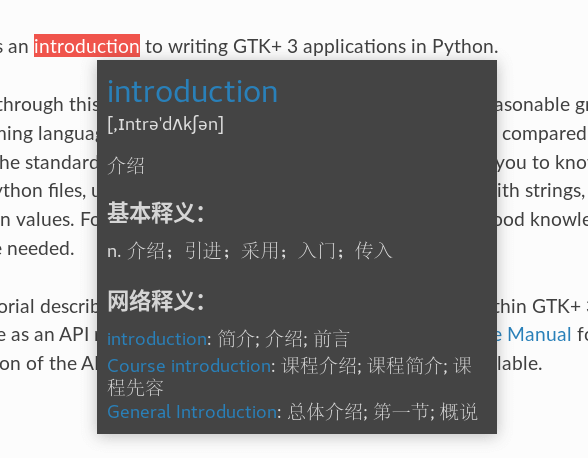

查看英文网页或阅读英文电子书时，划词翻译是个非常实用的功能。

之前一直在用 [youdao-dict-for-ubuntu](https://github.com/idning/youdao-dict-for-ubuntu)，这是个基于 Python 2 + Gtk+ 2 + webkit 编写的小工具，简单实用。但也有些不足：

<!--more-->

* Python 2 和 Gtk+ 2 都是过时的技术
* Python 2, Gtk+ 2, webkit 三者的 binding 依赖太多，又不在 Arch 的官方源里
* 功能有些小问题
    * 重复选择同一个单词不会触发翻译
    * 弹窗位置固定在鼠标下方，有时显示不完整
    * 一点击弹窗中的链接，弹窗就全白了，必须重启才能解决

所以一直想使用 Python 3 + Gtk+ 3 重写。之前尝试过在 youdao-dict-for-ubuntu 基础上改进，不过由于对 Python 和 Gtk+ 都不熟悉，没什么进展。最近 youdao-dict-for-ubuntu 的依赖出现过两次动态链接错误，已经无法使用了，我也不想再修，于是有了 [popup-dict](https://github.com/bianjp/popup-dict)。

[popup-dict](https://github.com/bianjp/popup-dict) 有以下特点：

* 使用 Python 3 + Gtk+ 3 开发，使用 Gtk+ 原生 UI
* 系统依赖少，只依赖 Python 3 + Gtk+ 3 + PyGObject
* 使用多线程技术，主线程不阻塞，响应快
* 封装查询接口，便于切换不同翻译服务
* 弹窗位置自适应，保证显示完整
* 弹窗中显示链接，点击打开在线词典
* 方便打开/禁用词典，避免不需要的时候打扰（通过 Gnome Shell Extension [popup-dict-switcher](https://github.com/bianjp/popup-dict-switcher) 实现一键开/关）

目前还只支持[有道智云](http://ai.youdao.com/)的翻译服务，功能也还有些不足，会逐渐完善。

这个工具主要还是为满足我个人的使用环境、需求（Arch Linux + Gnome 3，主要用于浏览器和 PDF 阅读器），同时也作为一个练手、学习项目。有时间有精力的话会尽量做完善，没有的话就只满足个人需要了。
