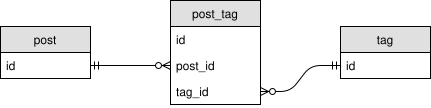

When updating many-to-many relationships, the SQL executed by JPA may be quite inefficient.

Suppose we have a Post-Tag association: each post can have multiple tags, and each tag can also has multiple posts.

<!--more-->



Java code:

```java
// Post.java
@Entity
public class Post {
  @Id
  private Integer id;
  
  @ManyToMany(cascade = {CascadeType.PERSIST, CascadeType.MERGE})
  @JoinTable(
    name = "post_tag",
    joinColumns = @JoinColumn(name = "post_id"),
    inverseJoinColumns = @JoinColumn(name = "tag_id")
  )
  private List<Tag> tags = new ArrayList<>();

  // getters and setters

  public void addTag(Tag tag) {
    tags.add(tag);
    tag.getPosts().add(this);
  }

  public void removeTag(Tag tag) {
    tags.remove(tag);
    tag.getPosts().remove(this);
  }
}

// Tag.java
@Entity
public class Tag {
  @Id
  private Integer id;
  
  @ManyToMany(mappedBy = "tags")
  private List<Post> posts = new ArrayList<>();

  // getters and setters
}
```

Suppose a post(id = 1) has two tags(id = 1, 2). When adding a new tag(id = 3) to the post, JPA may issue the following SQL:

```sql
DELETE FROM post_tag WHERE post_id = 1;
INSERT INTO post_tag(post_id, tag_id) VALUES (1, 1);
INSERT INTO post_tag(post_id, tag_id) VALUES (1, 2);
INSERT INTO post_tag(post_id, tag_id) VALUES (1, 3);
```

While inserting a single record is enough, it at first deletes all existing association records, and then creates all "new" association records. Same problems applies when deleting tags from the post.

It's quite inefficient. And if you have additional columns ("createdAt" for example) in the association table, or you have some triggers based on inserting/deleting association records, you may encounter some problems.

How to solve this problem? There may be two solutions.

## Solution 1: Use `Set` instead of `List` for collection attributes

This works, but I have no idea why.

```java
// Post.java
public class Post {
  private Set<Tag> tags = new HashSet<>();
}

// Tag.java
public class Tag {
  private Set<Post> posts = new HashSet<>();
}
```

__Since `Set` ensure uniqueness, make sure your entities has proper `hashCode` and `equals` implementations.__

## Solution 2: Split into two bidirectional `@OneToMany` associations

This solution comes from the [Hibernate documentation](https://docs.jboss.org/hibernate/orm/5.2/userguide/html_single/Hibernate_User_Guide.html#associations-many-to-many-bidirectional-with-link-entity). 

Currently I can not make it work. Maybe it's because of some Hibernate bugs about `orphanRemoval` ([#6709](https://hibernate.atlassian.net/browse/HHH-6709)).

```java
// Post.java
@Entity
public class Post {
  @Id
  private Integer id;

  @OneToMany(
    mappedBy = "post",
    cascade = CascadeType.ALL,
    orphanRemoval = true,
    fetch = FetchType.EAGER
  )
  private List<PostTag> postTags = new ArrayList<>();

  // getters and setters

  public void addTag(Tag tag) {
    PostTag postTag = new PostTag(this, tag);
    postTags.add(postTag);
    tag.getPostTags().add(postTag);
  }

  public void removeTag(Tag tag) {
    PostTag postTag = new PostTag(this, tag);
    postTags.remove(postTag);
    tag.getPostTags().remove(postTag);
  }
}

// Tag.java
@Entity
public class Tag {
  @Id
  private Integer id;

  @OneToMany(
    mappedBy = "tag",
    cascade = CascadeType.ALL,
    orphanRemoval = true,
    fetch = FetchType.EAGER
  )
  private List<PostTag> postTags = new ArrayList<>();

  // getters and setters
}

// PostTag.java
@Entity
public class PostTag {
  @Id
  private Integer id;

  @ManyToOne(optional = false)
  private Post post;

  @ManyToOne(optional = false)
  private Tag tag;

  // constructors, getters and setters

  @Override
  public int hashCode() {
    return Objects.hash(post, tag);
  }

  @Override
  public boolean equals(Object other) {
    if (this == other) {
      return true;
    } else if (other == null || this.getClass() != other.getClass()) {
      return false;
    } else {
      PostTag otherEntity = (PostTag) other;
      return Objects.equals(post, otherEntity.post) && Objects.equals(tag, otherEntity.tag);
    }
  }
}
```

Example application source code is available on [GitHub](https://github.com/bianjp/spring-examples/tree/master/jpa-many-to-many-update-efficiency).

Test against Spring Boot 1.5.8 (bundled with Hibernate 5.0.12.Final).
